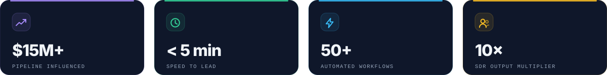
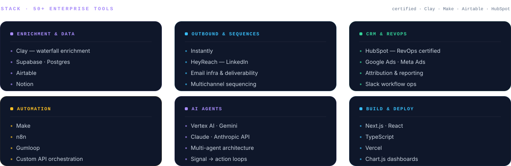

  

  
  
  
  

 

 

I design and ship the machinery behind revenue — signal-based outbound, enriched data
pipelines, agent-run workflows, and the reporting layer that proves any of it worked.
Six years across creative direction, sales operations and GTM engineering; these days
mostly building AI-native systems that replace manual GTM labour.

 

 

 

## Selected work

  
  

## Activity

  
  

 

  <b>Bengaluru, India</b> — working with clients globally &nbsp;·&nbsp; currently accepting select consulting clients
    
  

